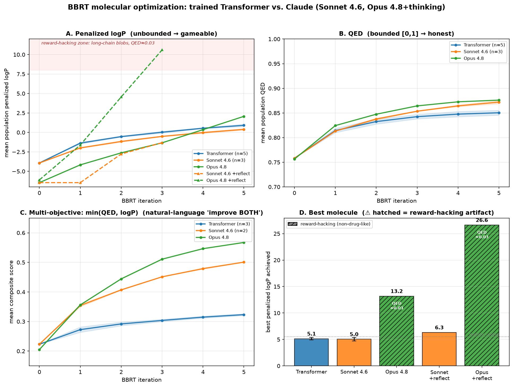

# Black Box Recursive Translations (BBRT)

A PyTorch / Lightning implementation of **Black Box Recursive Translations (BBRT)**
for molecular optimization ([arXiv:1912.10156](https://arxiv.org/abs/1912.10156)).

See the blog post here: https://stephenra.com/blog/bbrt

This is a modernized rewrite of the original OpenNMT-based code. The LSTM
sequence-to-sequence model has now been replaced by a **from-scratch Transformer
encoder–decoder** (with pre-norm, RMSNorm, rotary position embeddings, SwiGLU
feed-forward, and weight-tied shared embeddings), trained with **PyTorch Lightning**.
Molecules are represented as [SELFIES](https://github.com/aspuru-guzik-group/selfies),
which guarantees every decoded string is a valid molecule.

```
@article{damani2019black,
    title={Black Box Recursive Translations for Molecular Optimization},
    author={Farhan Damani and Vishnu Sresht and Stephen Ra},
    year={2019}, eprint={1912.10156}, archivePrefix={arXiv}, primaryClass={cs.LG}
}
```

## Workflow

BBRT iteratively (1) translates each seed molecule into candidates, (2) scores
the candidates by a target property, (3) keeps the best per seed, and (4) feeds
those back in as the next iteration's seed molecules.

## Installation

This project is managed with [uv](https://docs.astral.sh/uv/). Everything
(including RDKit) installs from PyPI.

```sh
uv sync                    # create .venv from uv.lock (adds the dev group too)
uv run bbrt --help         # run any command inside the environment
```

Add `--no-dev` to skip test/lint tooling. `uv run <cmd>` runs a command in the
project env; the examples below use it.

The package layout:

```
bbrt/
  config.py            # typed configs (YAML) — replaces the old shell flags
  data/                # SELFIES tokenizer, SMILES->SELFIES processing, DataModules
  models/              # Transformer components, shared encoder, seq2seq, DRD2 classifier
  inference/           # decoding (greedy/top-k/beam) + the BBRT loop
  scoring/             # featurizer, penalized logP, QED, DRD2, similarity, diversity
  train.py, train_drd2.py, generate.py, cli.py
configs/               # train.yaml, bbrt.yaml, drd2.yaml
```

## Usage

### 1. Build the training corpus

Convert a two-column (source, target) SMILES pairs file into a tokenized-SELFIES
parallel corpus plus a shared vocabulary:

```sh
uv run bbrt process --pairs data/logp04/train_pairs.txt --out data/logp04
# -> src_train.csv, tgt_train.csv, src_valid.csv, tgt_valid.csv, vocab.json
```

### 2. Train the Transformer

```sh
uv run bbrt train --config configs/train.yaml
# or override on the CLI:
uv run bbrt train --config configs/train.yaml --data-dir data/logp04 --output-dir output/logp04
```

Edit `configs/train.yaml` for architecture / optimizer / hardware settings. The
best checkpoint is written to `<output_dir>/best.ckpt` alongside `vocab.json`.

### 3. Run BBRT optimization

```sh
uv run bbrt generate --config configs/bbrt.yaml
```

Key `configs/bbrt.yaml` options:

| field | meaning |
|---|---|
| `score_func` | property to optimize: `logp04`, `qed`, or `drd2` |
| `similarity_min` | keep candidates within this Tanimoto of the seed (e.g. `0.4`); `null` = unconstrained |
| `translate_type` | `sd` (stochastic top-k sampling) or `beam` |
| `num_iters` | number of recursive translation rounds |
| `n_best` / `top_k` / `beam_size` | decoding breadth |
| `diverse_subset` | MaxMin-pick a diverse seed set |

Outputs (per iteration) land in `output_dir`: `prescored_preds_*.csv` (all
candidates), `scored_preds_*.csv` (best kept per seed), and `history.csv`
(population mean/std/max and running best).

## Results

The trained Transformer seq2seq vs. the `LLMGenerator` backend (Claude Sonnet 4.6
and Opus 4.8 +thinking) as the BBRT translation model, across three objectives —
penalized logP, QED, and a `min(QED, logP)` multi-objective composite — with
Tanimoto ≥ 0.4, 5 BBRT iterations, and error bands over restarts (Transformer 5,
Sonnet 2–3, Opus 1). Reproduce with [`experiments/`](experiments/).



| objective (metric) | Transformer | Sonnet 4.6 | Opus 4.8 +thinking |
|---|---:|---:|---:|
| QED — mean / best | 0.85 / 0.95 | 0.87 / 0.95 | **0.88** / 0.95 |
| multi-objective composite — Δ mean | +0.10 | +0.28 | **+0.36** |
| penalized logP — best | 5.1 ± 0.2 | 5.0 ± 0.3 | 13.2 ⚠️ / +reflect 26.6 ⚠️ |

Two findings. **(1)** On *bounded* objectives, a general-purpose LLM with zero
molecular training matches or beats the purpose-trained model, and roughly triples the
multi-objective improvement through plain natural-language steering (e.g., "improve
*both* QED and logP"). **(2) Penalized logP is a broken benchmark**: This has been well established ([Renz et al. 2019](https://www.sciencedirect.com/science/article/pii/S1740674920300159)) for a number of reasons but foremost in that logP grows
approximately linearly with carbon count, so the more capable and reflective the optimizer, the
harder it may "reward-hack" with long alkyl-chain blobs (e.g., best "molecules" had a penalized logP of 13.2 (Opus),
and 26.6 (Opus +reflection), however, the corresponding QED was ≈ 0.03, or non-drug-like). Reflection ([OPRO-style](https://arxiv.org/abs/2403.07691)
propose→score→re-propose) amplifies what the metric consequently rewards. QED and the composite score are more trustworthy, whereas
logP numbers with the exploit flagged (⚠️) are explicitly noted.

## DRD2 activity model

`score_func: drd2` uses an in-house classifier (the **same Transformer encoder**
as the seq2seq model with a small MLP head), trained on SELFIES. This replaces the
legacy ECFP-SVM pickle. To train, run the following:

```sh
uv run bbrt drd2-fetch                     # download the public DRD2 activity set
uv run bbrt drd2-train --config configs/drd2.yaml
# your own labeled CSV instead:  uv run bbrt drd2-train --data mydata.csv
# optionally warm-start the encoder from a seq2seq run:
uv run bbrt drd2-train --init-from output/logp04/best.ckpt
```

This writes `output/drd2/best.ckpt` + `vocab.json` (reported with AUROC/AUPRC).
The scorer loads it from `BBRT_DRD2_CKPT` (default `output/drd2/best.ckpt`). The
public data comes from
[MolecularAI/ReinventCommunity](https://github.com/MolecularAI/ReinventCommunity)
(ExCAPE-DB → Olivecrona lineage; `--data` overrides with your own SMILES+label CSV,
columns auto-detected).

## Tests, lint, type-check

```sh
uv run pytest              # full suite incl. seq2seq + DRD2 end-to-end smokes
uv run ruff check bbrt tests
uv run ruff format --check bbrt tests
uv run mypy bbrt
uv run pre-commit install  # optional: run the above on every commit
```

The BBRT and DRD2 smoke tests run end-to-end on tiny synthetic data (no
pretrained weights needed), so `uv run pytest` fully exercises the pipelines.

## Notes

- **Penalized logP** delegates the synthetic-accessibility term to RDKit's bundled
  `SA_Score` contrib module (no vendored `fpscores.pkl.gz` needed). logP and QED
  are pure RDKit.
- The original 2017 ECFP-SVM DRD2 oracle was replaced by the Transformer classifier
  above. However, it remains in git history if a zero-training oracle is ever needed.
