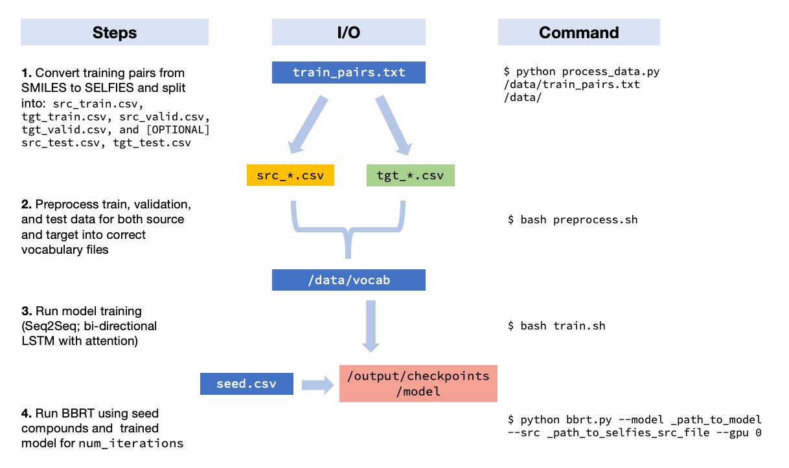

# Black box recursive translations (BBRT)

This repo contains the code for training and iterative inference of a neural translation model with the [black box recursive translation (BBRT)](https://arxiv.org/abs/1912.10156) algorithm. 

If you do use this for your own project, please consider citing:

```
@article{damani2019black,
    title={Black Box Recursive Translations for Molecular Optimization},
    author={Farhan Damani and Vishnu Sresht and Stephen Ra},
    year={2019},
    eprint={1912.10156},
    archivePrefix={arXiv},
    primaryClass={cs.LG}
}
```

## Getting Started

First, clone the repo:

```sh
$ git clone --recursive https://github.com:/PfizerRD/bbrt.git
```

Next, load the OpenNMT submodule:

```sh
git submodule update --init
```

## Usage

The recommended workflow for BBRT is:




### Preprocessing


```
$ bash preprocess.sh
```

### Training an NMT model

```
$ bash train.sh 
```

### Running the BBRT algorithm

An example:

```sh
python bbrt.py --model _path_to_onmt_model  --src _path_to_selfies_src_file --gpu 0
```

For the BBRT script, parameters are set at the bottom of the script instead of adding to `argparse`, due to conflicts with ONMT API. Therefore, for now you must specify `model` and `src` paths at the command line and everything else at the bottom of this file.